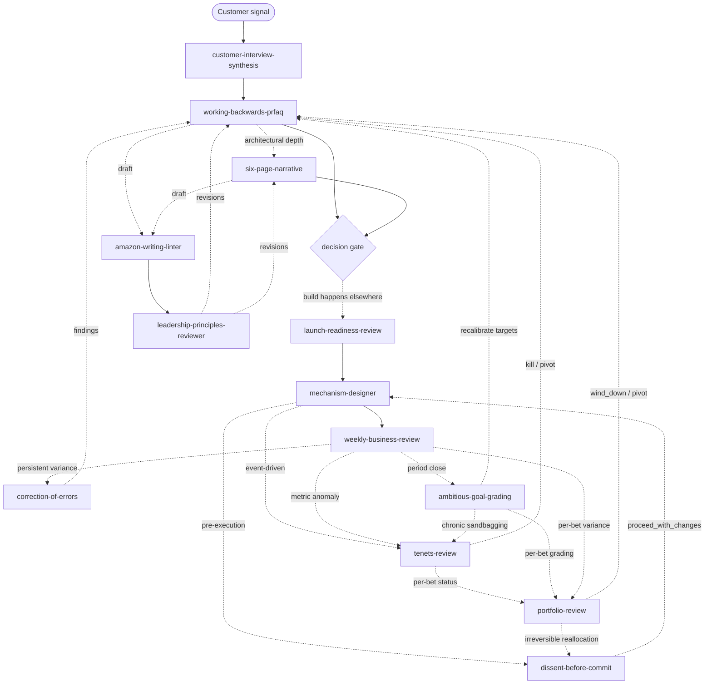

<h1 align="center">Amazonian Agent Skills</h1>

<p align="center">
  Turn good judgment into repeatable mechanisms.<br/>
  Not vibes. Not "think strategically." Mechanisms with gates, schemas, checks, and audit trails.
</p>

<p align="center">
  <sub>Unofficial. Not affiliated with or endorsed by Amazon.com, Inc.</sub>
</p>

---

A small, opinionated suite of agent skills that translates **operational discipline** — originating in Amazon's mechanisms (PRFAQ, six-page narratives, Weekly Business Reviews, Correction of Errors, mechanism design, Leadership Principles review) and enriched with adjacent practices where they sharpen the bar — into composable, inspectable agent workflows.

> Mechanisms make bad thinking expensive *before* bad execution becomes expensive.

Most agent skills tell the model to "be thoughtful." That is not a mechanism; that is a vibe. The skills in this suite refuse to emit output if the inputs are vague, tag claims with `[assumption]` when evidence is thin, hand off to the next skill in a deterministic chain, and — for any skill that gates an artifact's ongoing validity over time — declare a [named failure mode](GLOSSARY.md#named-failure-modes-cross-reference) they exist to catch.

<p align="center">
  
</p>

## What this suite is

This is the **governance layer** around a product development lifecycle — not a PDLC itself. It handles the entrance (Discover, Define) and the exit (Operate, Learn) of any significant bet. Build and most of Launch happen in your engineering tooling, deliberately out of scope here. The suite's value is in making the bookends load-bearing enough that the middle has somewhere honest to attach. See [`LIFECYCLE.md`](LIFECYCLE.md) for the phase map and the deliberate omissions.

The suite is also opinionated about its own architecture. Skills split into **constructive** (produce an artifact) and **interrogative** (stress-test an artifact, produce revisions). Interrogative skills that gate ongoing validity declare a named failure mode — `founder bias laundering`, `PRFAQ drift`, `metric satisficing`, `sandbagging laundering`, `stale dissent reuse`, `portfolio drift`. Each names a way a previously-honest signal goes stale (or was never honest to begin with) while looking healthy. That pattern is the suite's signature commitment, codified in [`SKILL_DESIGN_PATTERN.md`](SKILL_DESIGN_PATTERN.md#named-failure-modes) and indexed in [`GLOSSARY.md`](GLOSSARY.md#named-failure-modes-cross-reference).

## Quick start

```bash
# Personal scope (available across all your projects)
mkdir -p ~/.cursor/skills
cp -R skills/* ~/.cursor/skills/

# Or project scope (shared with the repo)
mkdir -p .cursor/skills
cp -R skills/* .cursor/skills/
```

Once installed, the agent will discover skills by description. You can also invoke explicitly:

```text
Use the working-backwards-prfaq skill to draft a PRFAQ for <idea>.
```

## The operating chain

`amazon-writing-linter` and `leadership-principles-reviewer` are cross-cutting passes that any authoring skill runs against its own draft. The remaining skills compose into the operating loop — Discover → Define → Design → (Build, elsewhere) → Launch → Operate → Learn — with feedback edges where each phase's findings flow back to revise upstream artifacts.



Solid arrows = the operating loop. Dotted arrows = review passes and feedback. Field-level handoffs are documented in each skill's `## Handoffs` section.

## Skills

| # | Skill | Reads | Emits |
|---|-------|-------|-------|
| 01 | [`working-backwards-prfaq`](skills/01-working-backwards-prfaq/SKILL.md) | An idea | PRFAQ packet with `success_metrics`, customer, FAQ |
| 02 | [`amazon-writing-linter`](skills/02-amazon-writing-linter/SKILL.md) | Any draft in this suite | Linted text; vague adjectives stripped, unsupported claims flagged, owners surfaced |
| 03 | [`six-page-narrative`](skills/03-six-page-narrative/SKILL.md) | A strategy or architecture | Decision memo with risks, alternatives, and dissent |
| 04 | [`mechanism-designer`](skills/04-mechanism-designer/SKILL.md) | A goal + `success_metrics` | Recurring mechanism with cadence, inputs, inspection, escalation |
| 05 | [`weekly-business-review`](skills/05-weekly-business-review/SKILL.md) | Metrics + a mechanism spec | WBR with required variance analysis |
| 06 | [`correction-of-errors`](skills/06-correction-of-errors/SKILL.md) | An incident | Blameless Five Whys review with action items and owners |
| 07 | [`leadership-principles-reviewer`](skills/07-leadership-principles-reviewer/SKILL.md) | A proposal | Review against Amazon-style leadership principles; contradictions and hidden risk |
| 08 | [`customer-interview-synthesis`](skills/08-customer-interview-synthesis/SKILL.md) | Raw interview transcripts, notes, surveys (≥ 8 for PRFAQ-grade) | PRFAQ-ready structured inputs with behavioral vs attitudinal evidence tags and cited bias flags |
| 09 | [`launch-readiness-review`](skills/09-launch-readiness-review/SKILL.md) | Original PRFAQ + current build state + rollback testability | Gate decision (`go` / `no_go` / `conditional_go` / `defer`) with PRFAQ drift report and pre-mortem |
| 10 | [`tenets-review`](skills/10-tenets-review/SKILL.md) | Product tenets + original PRFAQ + external context changes + metrics | Bet recommendation (`continue` / `kill` / `pivot` / `escalate`) with tenet validity report and metric-satisficing warning |
| 11 | [`ambitious-goal-grading`](skills/11-ambitious-goal-grading/SKILL.md) | Period goals (with targets, actuals, stated difficulty) + original PRFAQ + optional prior gradings | Per-goal calibration assessment, chronic-pattern detection across periods, recalibration recommendations, and sandbagging-laundering warnings |
| 12 | [`dissent-before-commit`](skills/12-dissent-before-commit/SKILL.md) | A specific action about to execute (mechanism, launch, irreversible change) + authoring artifact + state changes since + dissent history | Execution-time gate (`proceed` / `proceed_with_changes` / `pause` / `escalate`) with the strongest current case named, reversibility classification, and stale-dissent warning |
| 13 | [`portfolio-review`](skills/13-portfolio-review/SKILL.md) | All current bets (each with PRFAQ, recent tenets-review, recent goal-grading, WBR variance) + candidate alternatives + total capacity | Per-bet recommendations (`continue` / `wind_down` / `amplify` / `hold` / `pivot`), per-candidate decisions, a zero-based reallocation comparison, and a portfolio-drift report |

Every skill conforms to [`SKILL_DESIGN_PATTERN.md`](SKILL_DESIGN_PATTERN.md). The disqualifying criteria in that doc are the bar. Shared vocabulary (assumption tags, variance classifications, metric types, decision recommendations, principle scores, gate decisions, tenet status, calibration assessment, dissent recommendation, reversibility, portfolio bet recommendation, candidate decision) lives in [`GLOSSARY.md`](GLOSSARY.md) and [`vocabulary.yaml`](vocabulary.yaml).

[`LIFECYCLE.md`](LIFECYCLE.md) positions the suite as the **governance layer** around a product development lifecycle — explicitly *not* a PDLC — and shows which phases each skill covers and which it deliberately omits.

## What this suite is not

- A management cult.
- A blanket endorsement of any particular company culture.
- A magic productivity layer.
- A replacement for talking to the actual customer.
- A complete product development lifecycle. It governs the bookends; the middle happens in your engineering tooling.

These are mechanisms for *thinking visibly in writing*. They make bad reasoning expensive in a forum where it is cheap to fix.

## Influences

The suite is Amazon-origin at its core. Where adjacent practices sharpen the discipline, they have been adopted with attribution:

| Skill | Primary influence |
|---|---|
| `01` – `07` (PRFAQ, linter, six-pager, mechanism-designer, WBR, CoE, LP-reviewer) | Amazon's publicly described operational mechanisms |
| `08` `customer-interview-synthesis` | Lean Startup / Steve Blank customer-development discipline; behavioral-vs-attitudinal evidence classification. `founder bias laundering` is a suite-original name for the governance failure mode. |
| `09` `launch-readiness-review` | Amazon-style gating combined with pre-mortem (Kahneman / Klein). `PRFAQ drift` is a suite-original name. |
| `10` `tenets-review` | Amazon tenets framing; `metric satisficing` is a suite-original name for a generic governance failure mode |
| `11` `ambitious-goal-grading` | OKR convention (Google-origin) — 0.7 attainment as the honest-calibration norm — repurposed as an interrogative grading lens |
| `12` `dissent-before-commit` | Bezos one-way / two-way door framing extended with execution-time re-canvass; `stale dissent reuse` is suite-original |
| `13` `portfolio-review` | Google's OKR/portfolio-review cycle + venture-capital portfolio management; zero-based reallocation borrowed from zero-based budgeting. `portfolio drift` is a suite-original name. |
| The named-failure-mode pattern itself | Suite-original; emergent across skills 08–13 |

The suite's coherence comes from its **governance-layer architecture** more than from any single company's playbook. The name "Amazonian" describes origin, not identity — skills 11 and 13 in particular are Google-OKR-tradition, and the named-failure-mode pattern is suite-original.

## Repo layout

```text
amazonian/
├── README.md
├── LICENSE
├── SKILL_DESIGN_PATTERN.md
├── LIFECYCLE.md
├── lifecycle.yaml
├── GLOSSARY.md
├── vocabulary.yaml
└── skills/
    ├── 01-working-backwards-prfaq/
    │   ├── SKILL.md
    │   ├── templates/prfaq-template.md
    │   └── examples/example-prfaq.md
    ├── 02-amazon-writing-linter/
    │   ├── SKILL.md
    │   └── rules.yaml
    ├── 03-six-page-narrative/
    │   ├── SKILL.md
    │   └── template.md
    ├── 04-mechanism-designer/
    │   ├── SKILL.md
    │   └── mechanism-template.md
    ├── 05-weekly-business-review/
    │   ├── SKILL.md
    │   ├── wbr-template.md
    │   └── examples/example-wbr.md
    ├── 06-correction-of-errors/
    │   ├── SKILL.md
    │   ├── coe-template.md
    │   └── examples/example-coe.md
    ├── 07-leadership-principles-reviewer/
    │   ├── SKILL.md
    │   └── rubric.yaml
    ├── 08-customer-interview-synthesis/
    │   ├── SKILL.md
    │   └── bias-patterns.yaml
    ├── 09-launch-readiness-review/
    │   ├── SKILL.md
    │   └── readiness-checklist.md
    ├── 10-tenets-review/
    │   ├── SKILL.md
    │   └── tenet-template.md
    ├── 11-ambitious-goal-grading/
    │   ├── SKILL.md
    │   └── calibration-patterns.yaml
    ├── 12-dissent-before-commit/
    │   ├── SKILL.md
    │   └── dissent-perspectives.yaml
    └── 13-portfolio-review/
        ├── SKILL.md
        └── allocation-patterns.yaml
```

The three worked examples (`example-prfaq.md`, `example-wbr.md`, `example-coe.md`) share a common hypothetical product ("ChangeLens") so you can read them in sequence and see how the artifacts chain.

## Contributing

Proposed skills must satisfy the spine in [`SKILL_DESIGN_PATTERN.md`](SKILL_DESIGN_PATTERN.md).

## License

MIT. See [`LICENSE`](LICENSE).

## Disclaimer

"Amazon", "AWS", "Working Backwards", and the Amazon Leadership Principles are property of Amazon.com, Inc. This project is an independent interpretation of publicly described practices and is not affiliated with, endorsed by, or sponsored by Amazon.

OKR conventions referenced in `ambitious-goal-grading` and the portfolio-review cycle referenced in `portfolio-review` are general industry practice popularized by Google; this project is not affiliated with or endorsed by Google. Other named techniques (e.g., pre-mortem, Lean Startup customer-development practices, zero-based budgeting) are general industry practice cited as influences in [`Influences`](#influences) above.
