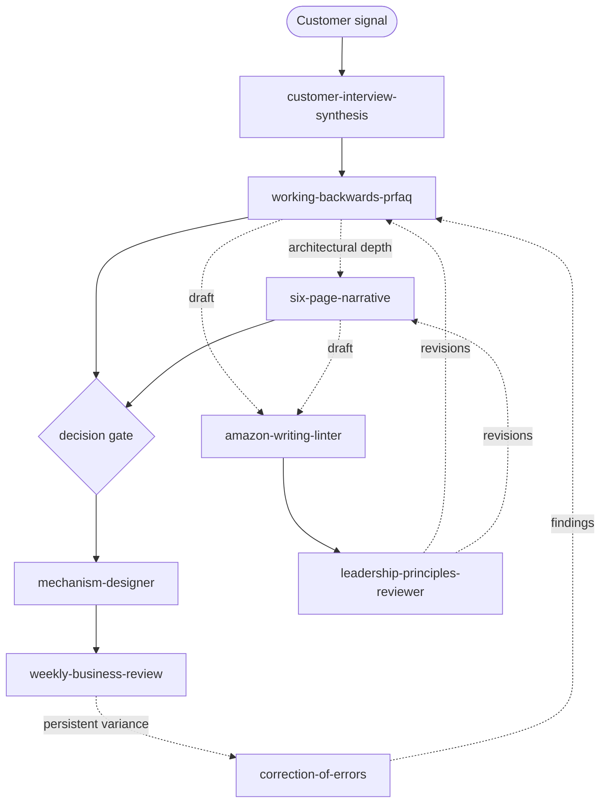

<h1 align="center">Amazonian Agent Skills</h1>

<p align="center">
  Turn good judgment into repeatable mechanisms.<br/>
  Not vibes. Not "think strategically." Mechanisms with gates, schemas, checks, and audit trails.
</p>

<p align="center">
  <sub>Unofficial. Not affiliated with or endorsed by Amazon.com, Inc.</sub>
</p>

---

A small, opinionated suite of agent skills that translates Amazon operational mechanisms — PRFAQ, six-page narratives, Weekly Business Reviews, Correction of Errors, mechanism design, and Leadership Principles review — into composable, inspectable agent workflows.

> Mechanisms make bad thinking expensive *before* bad execution becomes expensive.

Most agent skills tell the model to "be thoughtful." That is not a mechanism; that is a vibe. The skills in this suite refuse to emit output if the inputs are vague, tag claims with `[assumption]` when evidence is thin, and hand off to the next skill in a deterministic chain.

## Quick start

```bash
# Personal scope (available across all your projects)
mkdir -p ~/.cursor/skills
cp -R skills/* ~/.cursor/skills/

# Or project scope (shared with the repo)
mkdir -p .cursor/skills
cp -R skills/* .cursor/skills/
```

Once installed, the agent will discover skills by description. You can also invoke explicitly:

```text
Use the working-backwards-prfaq skill to draft a PRFAQ for <idea>.
```

## The operating chain

`amazon-writing-linter` and `leadership-principles-reviewer` are cross-cutting passes any authoring skill runs against its own draft. The other five form the operating loop.



Solid arrows = the operating loop. Dotted arrows = review passes and feedback. Field-level handoffs are documented in each skill's `## Handoffs` section.

## Skills

| # | Skill | Reads | Emits |
|---|-------|-------|-------|
| 01 | [`working-backwards-prfaq`](skills/01-working-backwards-prfaq/SKILL.md) | An idea | PRFAQ packet with `success_metrics`, customer, FAQ |
| 02 | [`amazon-writing-linter`](skills/02-amazon-writing-linter/SKILL.md) | Any draft in this suite | Linted text; vague adjectives stripped, unsupported claims flagged, owners surfaced |
| 03 | [`six-page-narrative`](skills/03-six-page-narrative/SKILL.md) | A strategy or architecture | Decision memo with risks, alternatives, and dissent |
| 04 | [`mechanism-designer`](skills/04-mechanism-designer/SKILL.md) | A goal + `success_metrics` | Recurring mechanism with cadence, inputs, inspection, escalation |
| 05 | [`weekly-business-review`](skills/05-weekly-business-review/SKILL.md) | Metrics + a mechanism spec | WBR with required variance analysis |
| 06 | [`correction-of-errors`](skills/06-correction-of-errors/SKILL.md) | An incident | Blameless Five Whys review with action items and owners |
| 07 | [`leadership-principles-reviewer`](skills/07-leadership-principles-reviewer/SKILL.md) | A proposal | Review against Amazon-style leadership principles; contradictions and hidden risk |
| 08 | [`customer-interview-synthesis`](skills/08-customer-interview-synthesis/SKILL.md) | Raw interview transcripts, notes, surveys (≥ 8 for PRFAQ-grade) | PRFAQ-ready structured inputs with behavioral vs attitudinal evidence tags and cited bias flags |

Every skill conforms to [`SKILL_DESIGN_PATTERN.md`](SKILL_DESIGN_PATTERN.md). The disqualifying criteria in that doc are the bar. Shared vocabulary (assumption tags, variance classifications, metric types, decision recommendations, principle scores, gate decisions, tenet status) lives in [`GLOSSARY.md`](GLOSSARY.md) and [`vocabulary.yaml`](vocabulary.yaml).

[`LIFECYCLE.md`](LIFECYCLE.md) positions the suite as the **governance layer** around a product development lifecycle — explicitly *not* a PDLC — and shows which phases each skill covers and which it deliberately omits.

## What this suite is not

- A management cult.
- A blanket endorsement of any particular company culture.
- A magic productivity layer.
- A replacement for talking to the actual customer.

These are mechanisms for *thinking visibly in writing*. They make bad reasoning expensive in a forum where it is cheap to fix.

## Repo layout

```text
amazonian/
├── README.md
├── LICENSE
├── SKILL_DESIGN_PATTERN.md
├── LIFECYCLE.md
├── GLOSSARY.md
├── vocabulary.yaml
└── skills/
    ├── 01-working-backwards-prfaq/
    │   ├── SKILL.md
    │   ├── templates/prfaq-template.md
    │   └── examples/example-prfaq.md
    ├── 02-amazon-writing-linter/
    │   ├── SKILL.md
    │   └── rules.yaml
    ├── 03-six-page-narrative/
    │   ├── SKILL.md
    │   └── template.md
    ├── 04-mechanism-designer/
    │   ├── SKILL.md
    │   └── mechanism-template.md
    ├── 05-weekly-business-review/
    │   ├── SKILL.md
    │   ├── wbr-template.md
    │   └── examples/example-wbr.md
    ├── 06-correction-of-errors/
    │   ├── SKILL.md
    │   ├── coe-template.md
    │   └── examples/example-coe.md
    ├── 07-leadership-principles-reviewer/
    │   ├── SKILL.md
    │   └── rubric.yaml
    └── 08-customer-interview-synthesis/
        ├── SKILL.md
        └── bias-patterns.yaml
```

The three worked examples (`example-prfaq.md`, `example-wbr.md`, `example-coe.md`) share a common hypothetical product ("ChangeLens") so you can read them in sequence and see how the artifacts chain.

## Contributing

Proposed skills must satisfy the spine in [`SKILL_DESIGN_PATTERN.md`](SKILL_DESIGN_PATTERN.md).

## License

MIT. See [`LICENSE`](LICENSE).

## Disclaimer

"Amazon", "AWS", "Working Backwards", and the Amazon Leadership Principles are property of Amazon.com, Inc. This project is an independent interpretation of publicly described practices and is not affiliated with, endorsed by, or sponsored by Amazon.
